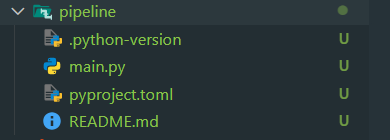

# Docker-Python-Pipeline
A Docker‑based pipeline with all required Python dependencies and then runs the script inside an isolated environment to ensure reproducible execution.

# Docker Setup
Docker Desktop can be downloaded from the official Docker website:
[Docker Download](https://www.docker.com/products/docker-desktop/)


# What is Docker?
Docker is a containerization platform that packages your application and its dependencies into lightweight, portable containers. It ensures consistent execution across different machines and environments, improving reliability and simplifying deployment.

# Creating a virtual env with the `vu` package

install the `uv` package in the global environment
```cmd 
pip install uv
```

check if the package is installed uv --version

using uv to create the virtual environment and install python 3.13 uv init --python 3.13
success? open the virtual environment and you will see the following files



# creating the virtual environment 
uv venv
.venv\Scripts\activate

## find inmportand links on how to use the `uv` package

[Main uv Documentation](https://docs.astral.sh/uv/)

